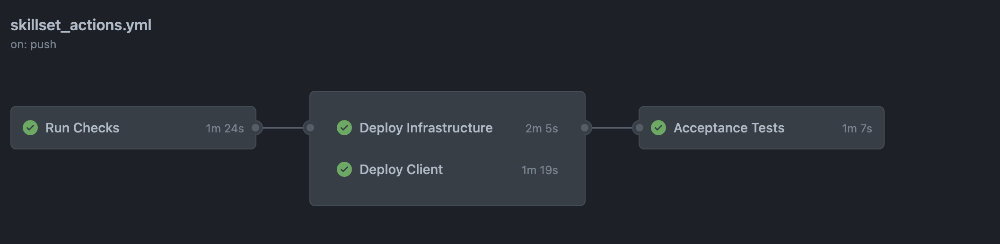
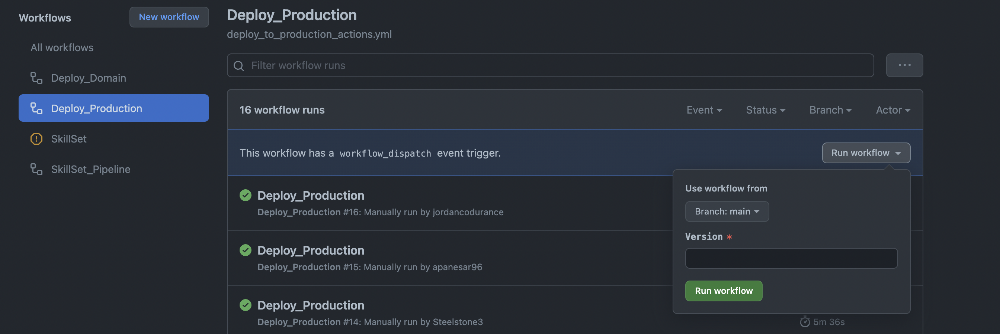

SkillSet
========

SkillSet is an internal tool for Codurance acting as an internal CV. This will allow consultants to be put on client-side projects that best suit them. It also allows for internally seeking mentors to learn new skills.

For Users
=========

### Accessing SkillSet

The production environment is hosted on this domain. User data is retained. USE THIS HYPERLINK AS A USER.

> https://skillset.codurance.io/

The staging environment is hosted on this domain. User data is wiped and seeded on codebase changes. USE THIS HYPERLINK AS A DEVELOPER.

> https://skillset-staging.codurance.io/

The application supports the following browsers for their last and latest version:

- Chrome
- Firefox
- Safari

For Developers
==============

This guide is for setting up and extending the current functionality of the application.

### Testing SkillSet Locally

This guide is for testing SkillSet within localhost and these steps are within the github action pipeline.

For each command you may need to adjust the path to where you have stored the project. 

The alias "run checks" runs both "npm run lint && npm run test".

You can also run to run basic linting errors.

> npx eslint . --fix

**Client**

> cd ./client
>
> npm install
>
> npm run checks

**Infrastructure**

> cd ./infrastructure
>
> npm install
>
> npm run checks

**Acceptance**

> cd ./acceptance
>
> npm install
>
> sls dynamodb start --migrate
> 
> npm run headless-mode

### Running Services Locally

During development, you may wish to run some or all of the services locally. Documented is a configuration guide.

**Local Infrastructure Configuration**

In cases where you wish to run infrastructure locally you will need to add an environment file

> touch ./infrastructure/.env
>
> echo ENV=dev > ./infrastructure/.env

**Running Client Locally**

To run the front end locally on localhost the following command can be run:

> npm install
>
> npm start

**Running Serverless Locally**

Requires downloading serverless as a dependency. This can be done in a variety of ways as well as through node.

> npm install serverless -g

Serverless can then be run offline with the following command.

> serverless offline --httpPort 3004

**Running Database Locally**

For running a database locally the following command should be run. This is needed for running the acceptance test.

> sls dynamodb start --migrate

### Application Setup and Dependencies

The application has the following dependencies

- node with typescript
- terraform
- AWS Credentials

Installed globally through npm
- serverless
- dynamoDB

**Installation Links**

- https://nodejs.org/en/download/
- npm install -g serverless
- npm install -g dynamodb
- https://www.terraform.io/downloads.html

### Extending Skills and Roles

To extend the "Skills" dropdown found in the profile editor navigate to this file within the project.

> ./client/src/profile/edit/ProfileSkill.ts

From here add a skill to the hard coded array.

> export const skills = [
>
> 'C#',
>
> 'Java',
>
> 'new skill here'
>
> ];

The same applies to roles found here.

> ./client/src/profile/edit/about/ProfileRole.ts

From here you can extend the roles in a similar way to before.

> export const roles = [
>
> 'Software Craftsperson In Training',
>
> 'Software Craftsperson',
>
> 'new role here'
>
> ];

Make sure to not add a trailing comma to the end of either array.

For Infrastructure
==================

This guide is for configuring and changing the application's infrastructure.

### CI/CD Pipeline

The CICD pipeline currently executes on pushes to main.

**Automated Staging**

- Run checks runs linting, tests and performs a cached installation.
- Deploy infrastructure stage deploys the current infrastructure with a seeded database.
- Deploy client stage deploys the current client build to a hosted store.
- Acceptance tests are performed on the staging environment. This uses cyprus running electron to test main user stories.

**Manual Deployment**

- Deployment is currently run in a manual workflow. 
- For this set the branch to main and set a version number then click run workflow. 
- This will then deploy the latest changes in staging to production. Data within the database will be retained (but not migrated).

**Domain Deployment**

- Deployment of the domain runs when there has been a change within:

> ./client/deployment

- This deploys a domain name to a hosted store.

### Configuring Google Single Sign-On

DEVELOPMENT TOKEN IN BITWARDEN OR SOMETHING.

### Configuring AWS Credentials 

In the event of needing to make changes to the AWS infrastructure the following guide can be followed to configure AWS credentials. At time writing the application is hosted in "Codurance Playground".

> https://docs.aws.amazon.com/sdk-for-java/v1/developer-guide/setup-credentials.html 

### Configuring Terraform

In the event of needing to make and locally run changes to the domain name i.e the website links install terraform for your operating system.

After this changes can be made within

> ./client/deployment

to the terraform files (main.tf etc...)

These changes are run on pushes to the main branch within the github actions but should the need arise can be run with the following commands:

> terraform init
> 
> terraform plan
> 
> terraform apply

### Future Developments

Some future developments have been considered for this project

- Database migration needs to be considered as a priority for migrating data for any database changes on the production server https://www.npmjs.com/package/dynamodb-migrations this library can be considered. Currently the application has a retain policy for the production server whereby any modifications to the database would need to be manually migrated or (worse) deleted loosing data integrity.

- For each of the input fields sanitised input needs to be considered from a 3rd party security input library. If this is not considered there is the potential for malicious actors within the application to gain unauthorised access. Simply removing all symbols in a sanitisation would mean things like searching for C# wouldn't work from within a search query.

- May want to consider semantic versioning for production releases https://semver.org/.

- May want to consider continuous deployment after acceptance tests have passed.